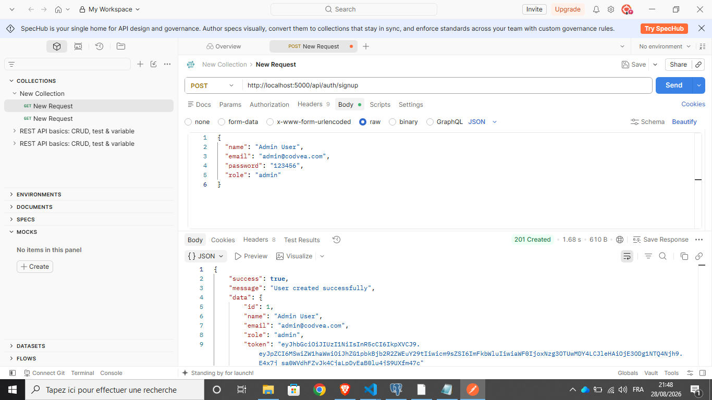
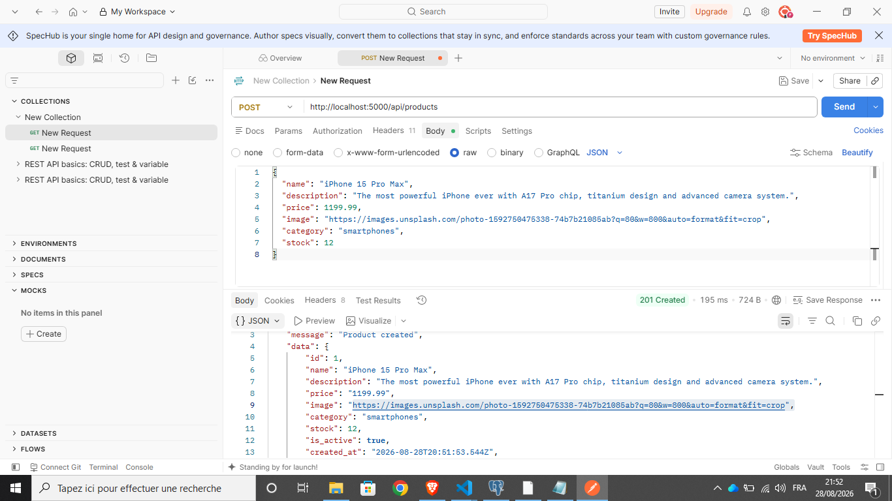
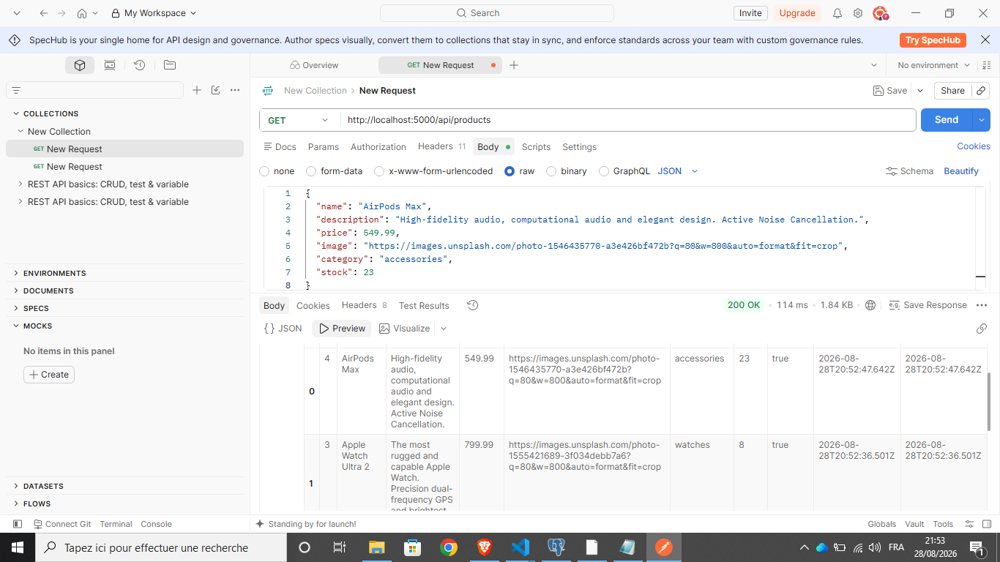
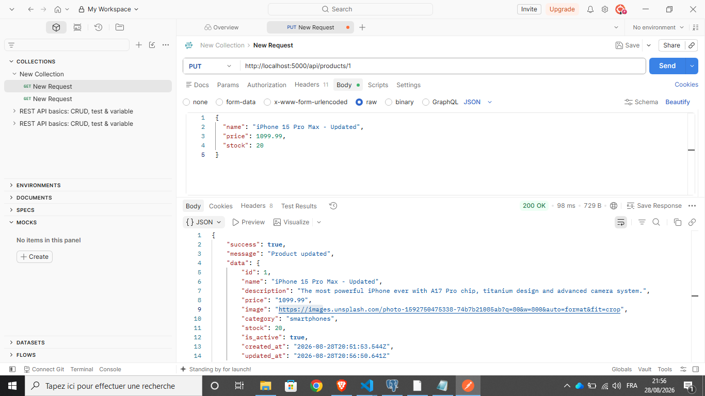
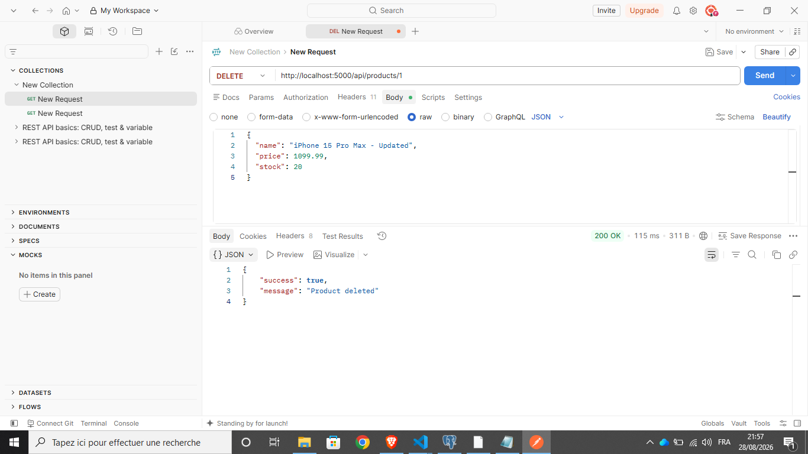
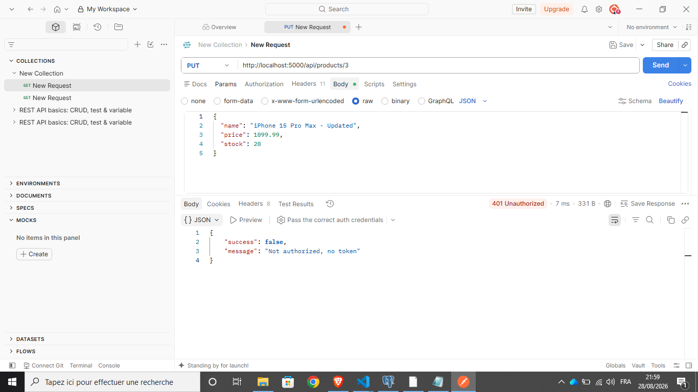

## API Testing (Postman)

### 1. Signup — إنشاء حساب Admin مع JWT

### 2. Create Product — إضافة منتج (201 Created)

### 3. Get Products — جلب كل المنتجات (200 OK)

### 4. Update Product — تحديث منتج (200 OK)

### 5. Delete Product — حذف منتج (200 OK)

### 6. Unauthorized — طلب بدون Token (401)

### 7. Forbidden — مستخدم عادي يحاول حذف منتج (403 Admin only)

### 8. Not Found — حذف منتج غير موجود (404)

